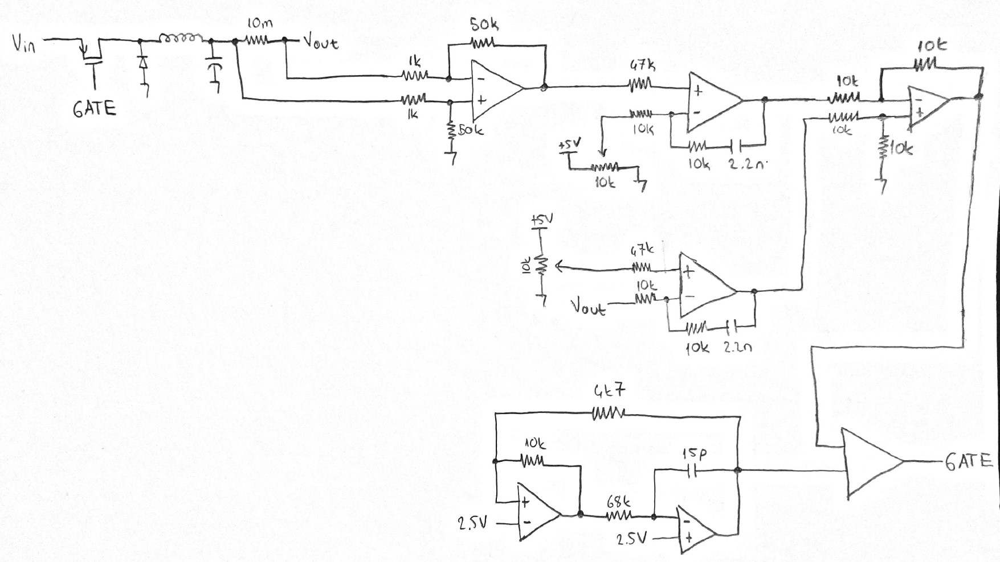

# Buck-Converter-Controller
Analog Buck Converter Controller with Current Limiting Feature

200 kHz buck controller circuit, used OPAx197s. 7805 used for reference voltage(to supply opamps). Also, frequency of triangle wave generater first was implemented for 12V, so you can use 12V regulator and 1 to 120 gain for reading current or voltage divider for feedback to get higher voltage outputs... Frequency 209 kHz --> 12V, 230 kHz --> 5V.

...

Drive part is up to you, also you can add a derivative control part. It was good enough for my application...

